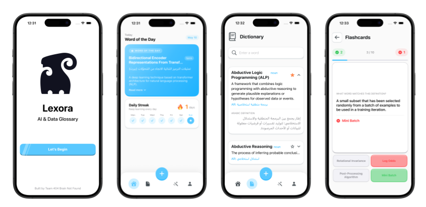

# Lexora — AI Glossary & Learning App

> A submission for the [AI Glossary Challenge (AIGC)](https://aigc.icaire.org/en) — an ICAIRE-led international initiative focused on ethical AI, cultural grounding, and AI governance in Saudi Arabia.

---

## Overview

Lexora is a SwiftUI-based iOS app built around a curated dataset of over 1,200 AI terms in English and Arabic. Developed as part of the **AI Glossary Challenge (تحدي معجم الذكاء الاصطناعي)**, the app aims to make AI terminology accessible, culturally grounded, and engaging for Arabic-speaking audiences.

The app combines a comprehensive bilingual dictionary with interactive learning tools and real-time word detection features — bridging the gap between AI literacy and cultural relevance.

---

## AI Glossary Challenge

The **AI Glossary Challenge** is an initiative by [ICAIRE](https://aigc.icaire.org/en) that promotes awareness of AI concepts through culturally grounded, bilingual terminology. Lexora directly supports this mission by:

- Providing a searchable, bilingual (English + Arabic) glossary of 1,200+ AI terms
- Making AI vocabulary accessible through interactive and gamified learning experiences
- Enabling real-time word detection via camera, voice, and video — lowering the barrier to discovering AI terminology in everyday contexts

---

## Screenshots
 

 
*From left to right: Onboarding, Home (Word of the Day + Daily Streak), Dictionary, Flashcards*
 
---

## Features

### 📖 Dictionary
- Browse and search 1,200+ AI terms in English and Arabic
- Paginated list with infinite scroll — loads 10 entries at a time
- Expandable cards showing the English definition, Arabic translation, and part of speech
- Part of speech is automatically detected using Apple's **Natural Language** framework, supporting multi-word terms
- Bookmark any word with the ★ button to save it for later review

### 🏠 Home
- **Word of the Day** — a deterministic daily term selected from the glossary based on the current date, the same word all day and a new one every day
- **Daily Streak** — tracks consecutive days of app usage using `UserDefaults`, with an animated weekly progress view

### 🎓 Learning Hub
- **Flashcards** — a 10-card session where each card shows a word's definition and four multiple-choice answer options. Tracks correct and incorrect answers, auto-advances after each response, and shows a results summary at the end
- **Word Search** — generates a 10×10 letter grid with 6 randomly selected glossary words placed in all 8 directions. Features pixel-based diagonal drag detection using `atan2` angle snapping for accurate selection

### ➕ Capture (Plus Button)
Three real-time word detection tools accessible from the center tab bar button:

- **📷 Camera Scanner** — live camera feed using `AVCaptureSession` and Apple's **Vision** framework for real-time OCR. Detected text is matched against the glossary and displayed in an overlay card when a term is found
- **🎤 Voice Detector** — uses `SFSpeechRecognizer` and `AVAudioEngine` to transcribe spoken words live, then looks them up in the glossary and navigates to the full definition
- **🎬 Video Extractor** — upload a video from the photo library. Speech is transcribed using timestamp-accurate `SFTranscriptionSegment` data. Words appear in a live sliding window of 10 at a time in sync with the video, with glossary matches highlighted as tappable blue pills

### 👤 Profile
- Displays all bookmarked words using the same expandable card style as the Dictionary
- Persisted across app sessions using `UserDefaults`
- Shows an empty state with guidance when no words have been saved yet

---

## Tech Stack

| Technology | Usage |
|---|---|
| SwiftUI | Entire UI |
| AVFoundation | Camera session, audio engine, video playback |
| Vision | Real-time OCR text recognition |
| Speech | Speech recognition for voice and video features |
| Natural Language | Part of speech detection |
| PhotosUI | Video picker |
| UserDefaults / AppStorage | Bookmarks, streak, onboarding state |
| NavigationStack + custom Router | App-wide navigation |

---

## Project Structure

```
Lexora/
├── App/
│   ├── LexoraApp.swift
│   ├── TabBarView.swift          # Onboarding gate
│   └── RootView.swift            # Tab bar + capture sheet
│
├── Resources/
│   ├── Assets.xcassets
│   └── glossary.csv              # 1,200+ AI terms (EN + AR)
│
├── Core/
│   ├── GlossaryService.swift     # CSV parser + search
│   ├── BookmarkService.swift     # Favorites persistence
│   └── Router.swift              # Navigation router
│
├── Extensions/
│   └── String+PartOfSpeech.swift # NLTagger extension
│
├── Components/
│   ├── BackButton.swift
│   ├── LetsStartButton.swift
│   ├── OutlinedButton.swift
│   ├── SearchBar.swift
│   ├── PageIndicator.swift
│   └── GlossaryCard.swift
│
├── Tabs/
│   ├── CustomTabBar.swift
│   ├── Home/
│   │   └── WordOfTheDayView.swift
│   ├── Dictionary/
│   │   ├── GlossaryView.swift
│   │   ├── GlossaryViewModel.swift
│   │   └── GlossaryDetailView.swift
│   ├── LearningHub/
│   │   ├── LearningHubView.swift
│   │   ├── Flashcards/
│   │   │   ├── FlashcardView.swift
│   │   │   └── FlashcardViewModel.swift
│   │   └── WordSearch/
│   │       ├── WordSearchView.swift
│   │       ├── WordSearchViewModel.swift
│   │       └── WordSearchEngine.swift
│   ├── Capture/
│   │   ├── CaptureSheetView.swift
│   │   ├── CameraWordScanner.swift
│   │   ├── CameraWordScannerView.swift
│   │   ├── VoiceWordDetector.swift
│   │   ├── VoiceWordDetectorView.swift
│   │   ├── VideoWordExtractor.swift
│   │   └── VideoWordExtractorView.swift
│   └── Profile/
│       └── ProfileView.swift
│
└── Navigation/
    └── RouterViewModifier.swift
```

---

## Requirements

- iOS 17.0+
- Xcode 15.0+
- Swift 5.9+
- Physical device required for camera and microphone features

---

## Setup

1. Clone the repository
```bash
git clone https://github.com/akkoshak/Lexora.git
```

2. Open `Lexora.xcodeproj` in Xcode

3. Select your development team under **Signing & Capabilities**

4. Build and run on a physical device (required for camera, microphone, and speech recognition)

---

## Permissions

The following keys must be present in `Info.plist`:

```xml
<key>NSCameraUsageDescription</key>
<string>Lexora uses the camera to detect AI terms in real-time.</string>

<key>NSMicrophoneUsageDescription</key>
<string>Lexora needs microphone access to listen for AI terms.</string>

<key>NSSpeechRecognitionUsageDescription</key>
<string>Lexora uses speech recognition to detect AI terms you say and in uploaded videos.</string>

<key>NSPhotoLibraryUsageDescription</key>
<string>Lexora needs access to your photo library to upload videos for word detection.</string>
```

---

## Dataset

The glossary dataset (`glossary.csv`) is sourced from the AI Glossary Challenge and contains 1,200+ AI terms with four columns:

| Column | Description |
|---|---|
| `English Term` | The AI term in English |
| `English Def.` | Full English definition |
| `Arabic Term` | The term translated to Arabic |
| `Arabic Def.` | Full Arabic definition |

---

## Acknowledgements

This project was built as a submission for the **AI Glossary Challenge (تحدي معجم الذكاء الاصطناعي)** organized by [ICAIRE](https://aigc.icaire.org/en) — an international initiative promoting ethical AI and cultural grounding in AI governance.

---

## License

This project is submitted for the AI Glossary Challenge. The glossary dataset is provided by ICAIRE and used for non-commercial, educational purposes only.

---

## Team

**404 Brain Not Found**

| Member | Role |
|---|---|
| Abdulkarim Koshak | UI/UX Design & Development |
| Abdulaziz Koshak | Research & Data Curation |
